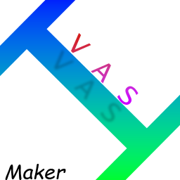

# mcIVASmaker
#### Video Demo:  https://www.youtube.com/watch?v=XHlJewmWWvU
#### Description:
mcIVASmaker is a program aimed to convert images, videos or audio(still unfinished) into minecraft blocks.

### Pre-requisites
#### General (Both exe and zip)
- **FFmpeg**, **FFProbe** added to your path.
#### Python/zip version
- Python 3.8+
- Specified libraries in requirements.txt
#### Exe Version
- Windows (May work on wine(untested))

### Installation / Running
#### Windows Executable
- Download the latest release from https://github.com/TejasIsCool/mcIVASmaker/releases/tag/Releases
- Make sure FFmpeg and FFProbe is in your path (Check it by running `ffpmeg --version` in command prompt).
- Run!
#### Zip Version
- Download the latest release from https://github.com/TejasIsCool/mcIVASmaker/releases/tag/Releases or by downloading the code zip file from the green button above.
- Make sure FFmpeg and FFProbe is in your path (Check it by running `ffpmeg --version` in command prompt).
- Run `main.py`!

  

On opening the program, you are greeted with three tabs, each for image/video/audio conversion to minecraft equivalent.

  
#### Image Tab
The image tab allows you to convert your selected image, into either
- Another image, where the pixels are the textures of minecraft blocks
- A schematic file, which can be opened by a schematic mod, to place the image, in the form of minecraft blocks, in your own world
  
You can convert your image to all possible minecraft blocks upto version 1.20, or you can restrict your selection, to only a certain blocks.
 
You can also convert your image to a redstone lamps display, again in either image, or schematic form

###### Working
To convert an image into minecraft blocks, this program basically reads every rgb pixel value of an image(Using Pillow), 
finds the closest Minecraft block approximate to that pixel, and it a new image, paste the selected minecraft block at the same location.
 
It does the same thing for the schematic format
  
To find the closest minecraft block, I have stored all minecraft blocks and their average color in the 
out.json file in the `assets/blocks/img_generator_code` folder. 
 This file stores all the average rgb pixel values for every Minecraft block(except for non-full sized blocks)
  
It compares the average color of every minecraft block to every pixel on the image. Then decides which block is the closest looking, and selects that.
  
I have tried to add a few optimizations too.
 - There is a cache function, which uses a cached result, when a same rgb color is found. Very useful for images with a small colour range.
 - It uses Numpy to paste blocks in the new image, as it is faster than standard Pillow paste.
  You may access a decent palette of blocks to be whitelisted in `assets/blocks/block_nice/idkdecent.txt`
  If you wish to add new textures, its painful
 - Go to `assets/blocks/img_generator_code/new_textures`, create a folder called `textures` in there, and put your textures there (In same name format as in the files of `assets/blocks/all_blocks_textures` folder)
 - Run `_blocks_to_avg_colors.py`, and then painfully correct the newly outputted `outx.json`. Then copy the corrected contents of the new json file, and paste it correctly into the `assets/blocks/img_generator_code/out.json`, so that it is like one continous javascript object.

#### Video Tab
The video tab allows you to do exactly what the image tab does, but to an entire video(Except for making schematics).
  
In its options, you are able to do pretty much what you can do for images, except cropping.  
You can however also change the frame rate of the video.  
There are also advance options, to set how many processes you can use, to speed up the minecraft blocks video creation.

###### Working
To convert a video into minecraft blocks, it firstly uses ffmpeg to convert the video into sequence of images.
 Then it uses the image to blocks converter to convert every single frame to minecraft blocks.
 Then using ffmpeg again, it rejoins all the blocks-frames into one video.
  
Of course, this would be incredibly slow if the conversion was done one frame at a time

That's why you can use multiple processes to simultaneously convert multiple frames into images.
 Or it uses multi-threading if you only use a single process.

###### Notes
Just remember, a video is made up of a lot of frames, and each frame is a single image. 
Therefore, it might take a really long time to for the whole video to be converted to minecraft blocks.  

Also, the output videos have a really high bit-rate, which might not be supported, by your video player.

FFmpeg does not support a really high resolution video(32k+ resolution), and it creates a lot of problems with high resolution videos in general.
 So it is advisable to set the output resolution to a low enough resolution.
